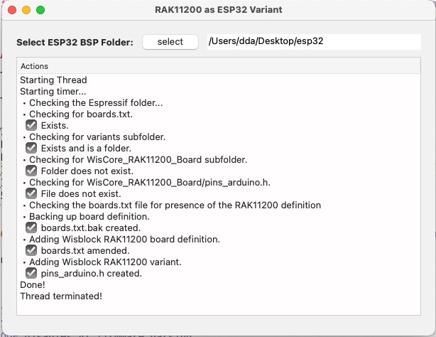

# RAK11200 as ESP32 Variant

A quick Xojo project that creates a [Wisblock RAK11200](https://store.rakwireless.com/products/wiscore-esp32-module-rak11200) variant in an Espressif esp32 BSP package, if, for... reasons, you don't want to install the official BSP, or want to use the Espressif BSP.

